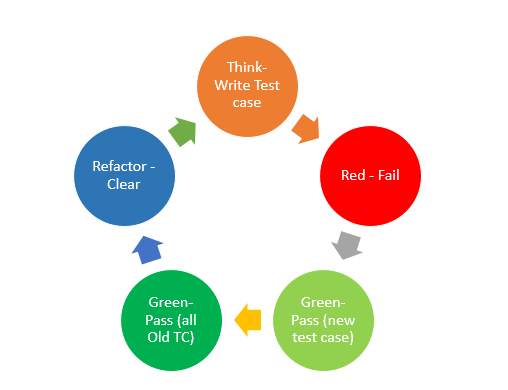

TDD tutorial with JUnit5
===

## 목표

- Test Code 작성에 대한 필요성과 장/단점에 대한 이해한다.
- 실습을 통해 TDD 기반의 코드 작성은 어떤 과정으로 진행되는지 살펴본다.

## TDD : 테스트 주도 개발, Test Driven Development

> 테스트 코드를 먼저 작성하고, 이를 통과시키는 코드를 구현하며, 리팩토링을 통해 최적화하는 반복적 개발 방법론

### TDD의 생명 주기

1. **계획**: 작성할 테스트 코드를 정의한다.
2. **실패**: 실패하는 테스트 케이스를 작성한다.
3. **구현**: 테스트를 통과하도록 최소한의 코드를 작성한다.
4. **검증**: 모든 테스트를 실행하여 사이드 이팩트 발생 여부를 확인한다.
5. **리팩토링**: 중복 제거 및 구조 개선 등의 리팩토링을 통해 코드를 최적화한다.

### TDD의 장점

- **빠른 피드백**: 모든 기능에 대한 테스트 코드를 통해 빠르게 실행하고 빠르게 확인 가능
- **안정성**: 테스트 코드 보호 아래 안전한 리팩토링 가능
- **문서화**: 테스트 코드 자체가 기능 명세 역할을 수행
- **낮은 결합도**: 테스트하기 쉬운 코드를 구성하는 과정은 결합도가 낮은 설계로 개선

## TDD의 단점

- 초기 학습 비용 및 테스트 코드 작성에 추가적인 시간 소요
- 테스트 코드 작성 및 관리에 대한 추가적인 정책 필요 (테스트 코드 실행에 필요한 의존성 범위 산정)
- 테스트 수가 많아질수록 CI/CD 실행 시간 증가

---

### BDD : 행위 주도 개발, Behavior Driven Development

- 시나리오 기반으로 테스트 코드를 작성하는 방법론
- 하나의 시나리오는 Given, When, Then 절의 구조를 포함하여 작성
    - Given : 테스트 코드 실행을 위해 필요한 통제 변인 선언 부
    - When : 테스트 대상 호출 부
    - Then : 테스트 결과 검증 부

---

## TDD 실습 예제

- ### [사칙 연산 계산기](docs/STEP1.md)
